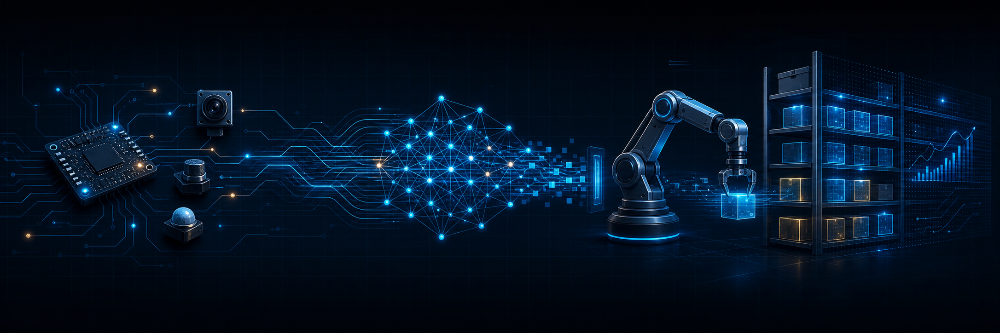

  

<h1 align="center">Hi, I'm Jess Michael Padogdog 👋</h1>

  <strong>Robotics · Edge AI · Embedded Systems · Full-Stack Development</strong>

  I build intelligent systems that connect software, sensors, and the physical world.

  

---

### What I build

- 🤖 Robotics systems that combine computer vision, motion, and real-time control
- 🧠 Private, on-device AI tools powered by language and vision models
- 🔌 Embedded and IoT prototypes using ESP32, Raspberry Pi, and sensor networks
- 📊 Full-stack dashboards that turn device data into useful decisions

### Featured work

<table>
  <tr>
    <td width="50%" valign="top">
      <h3>📦 <a href="https://github.com/JessMichaelPad/Smart-Shelf-System">Smart Shelf System</a></h3>
      
An end-to-end inventory monitoring prototype connecting ESP32 shelf nodes to a Node.js gateway, MongoDB API, and React dashboard.

      
<code>ESP32</code> <code>React</code> <code>Node.js</code> <code>MongoDB</code>

    </td>
    <td width="50%" valign="top">
      <h3>🗂️ <a href="https://github.com/JessMichaelPad/AI-Powered-File-Manager">AI-Powered File Manager</a></h3>
      
A privacy-first organizer that uses local language and vision models to understand, rename, and categorize documents and images.

      
<code>Python</code> <code>Local AI</code> <code>OCR</code> <code>VLM</code>

    </td>
  </tr>
  <tr>
    <td colspan="2" valign="top">
      <h3>🦾 <a href="https://github.com/JessMichaelPad/MSU-IIT_Robotics_and_AI_Projects">Robotics & AI Projects</a></h3>
      
Interactive A* pathfinding and robot-kinematics simulations, plus an autonomous interception robot built with YOLOv8, Raspberry Pi 5, ESP32, and Mecanum drive.

      
<code>Computer Vision</code> <code>YOLOv8</code> <code>Python</code> <code>C++</code> <code>JavaScript</code>

    </td>
  </tr>
</table>

### Toolbox

  
  
  
  
  
  
  
  

### Right now

- 🔭 Refining connected-device prototypes from firmware through frontend
- 🌱 Exploring edge AI, computer vision, and reliable embedded architectures
- 💬 Happy to talk about robotics, IoT, and practical AI systems

---

  <em>Turning ideas into systems that sense, think, and act.</em>

