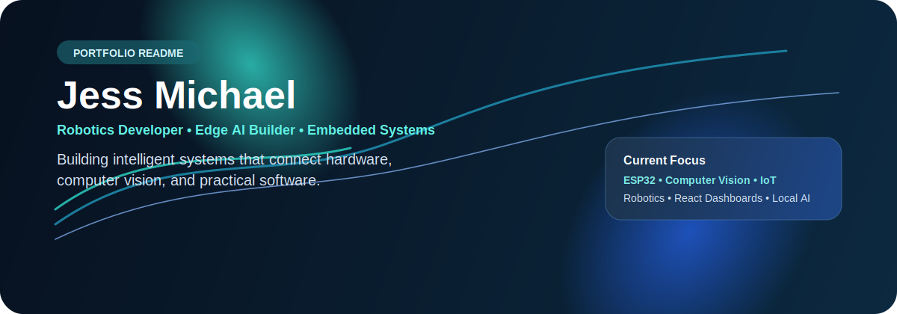

  

  <strong>Robotics Developer · Edge AI Builder · Embedded Systems</strong>

  I build systems that are meant to sense, think, and act.

  

---

### What I build

- 🤖 Robotics systems that combine computer vision, motion, and real-time control
- 🧠 Private, on-device AI tools powered by language and vision models
- 🔌 Embedded and IoT prototypes using ESP32, Raspberry Pi, and sensor networks
- 📊 Full-stack dashboards that turn device data into useful decisions

### Featured work

#### 📦 [Smart Shelf System](https://github.com/JessMichaelPad/Smart-Shelf-System)

> IoT inventory monitoring that connects ESP32 shelf nodes to a Node.js gateway, MongoDB API, and React dashboard.

`ESP32` · `React` · `Node.js` · `MongoDB`

#### 🗂️ [AI-Powered File Manager](https://github.com/JessMichaelPad/AI-Powered-File-Manager)

> A privacy-first organizer using local language and vision models to understand, rename, and categorize files.

`Python` · `Local AI` · `OCR` · `Vision Models`

#### 🦾 [Robotics & AI Projects](https://github.com/JessMichaelPad/MSU-IIT_Robotics_and_AI_Projects)

> Interactive pathfinding and robot-kinematics simulations, plus an autonomous interception robot built with YOLOv8, Raspberry Pi 5, ESP32, and Mecanum drive.

`Computer Vision` · `YOLOv8` · `Python` · `C++` · `JavaScript`

### Toolbox

  
  
  
  
  
  
  
  

### Right now

- 🔭 Refining connected-device prototypes from firmware through frontend
- 🌱 Exploring edge AI, computer vision, and reliable embedded architectures
- 💬 Happy to talk about robotics, IoT, and practical AI systems

---

  <em>Turning ideas into systems that sense, think, and act.</em>

